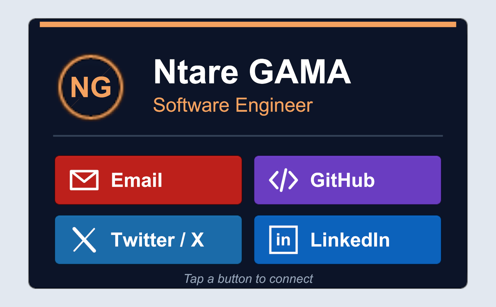

# Unity - AR Business Card

A marker-based AR business card built with Unity 6000.4.5f1 and Vuforia Engine 11.4.4.
Point the phone camera at the printed marker: the card pops up from the marker, stands up,
and the header and link buttons animate in. Tapping a button plays a click, bounces the button,
and opens the link.



## Marker

This project uses a custom marker: [Marker/ARBusinessCardMarker.png](Marker/ARBusinessCardMarker.png).
It uses high-contrast, non-repeating shapes with many sharp corners so Vuforia can detect it reliably.
Print it about 15 cm wide, or show it full screen on another device.

## Tasks

| Task | Where |
| --- | --- |
| 0. Layout | `0-layout` (link to `Screenshots/BusinessCardLayout.png`) |
| 1. Target acquired | `ARMarkerTarget` creates the image target from the marker when Vuforia starts. It anchors the card to the target and shows the card only while the target status is `TRACKED`. |
| 2. Animated reality | `BusinessCardAnimator`: the card pops up and tilts to 55°, the accent bar sweeps open, the header slides in, the buttons pop in one by one, then the card floats gently while idle |
| 3. Social link up | `LinkButton`: each button opens its link with `Application.OpenURL` (`mailto:`, GitHub, X, LinkedIn). Pressing gives a color tint, a squash-and-bounce, and a click sound. |
| 4. Builds | `Builds/Android/ARBusinessCard.apk`, `Builds/iOS/` (Xcode project) |

Android requires API 29 or higher (a Vuforia 11 requirement). IL2CPP, ARM64.

Accessibility: the white text on the buttons meets WCAG AA contrast. Every button has a text label, not only an icon or a color. Buttons are large and well spaced for touch. The idle motion is small, so the text stays readable.

## Project structure

```
Assets/
  Scenes/ARBusinessCard.unity
  Scripts/        ARMarkerTarget.cs, BusinessCardAnimator.cs, LinkButton.cs
  Editor/         ARBusinessCardBuilder.cs (generates the scene and the builds)
  Textures/       marker + Icons/
  Audio/          ButtonClick.wav
Marker/           printable marker
Screenshots/      layout screenshot
```

## Setup

1. Get the Vuforia package. The tarball is 138 MB, which is over GitHub's file size limit, so it is git-ignored.
   Import `add-vuforia-package-11-4-4.unitypackage` from developer.vuforia.com/downloads/sdk,
   or copy `com.ptc.vuforia.engine-11.4.4.tgz` into `Packages/`.
2. Paste your Vuforia license key in **Edit > Project Settings > Vuforia Engine**.
   `Assets/Resources/VuforiaConfiguration.asset` is git-ignored so the key stays private.
3. Open `Assets/Scenes/ARBusinessCard.unity`.

The card text and links live in the constants at the top of `Assets/Editor/ARBusinessCardBuilder.cs`.
After editing them, run **AR Business Card > Build Scene**. Use **Build Android** or **Build iOS** to rebuild the players.
